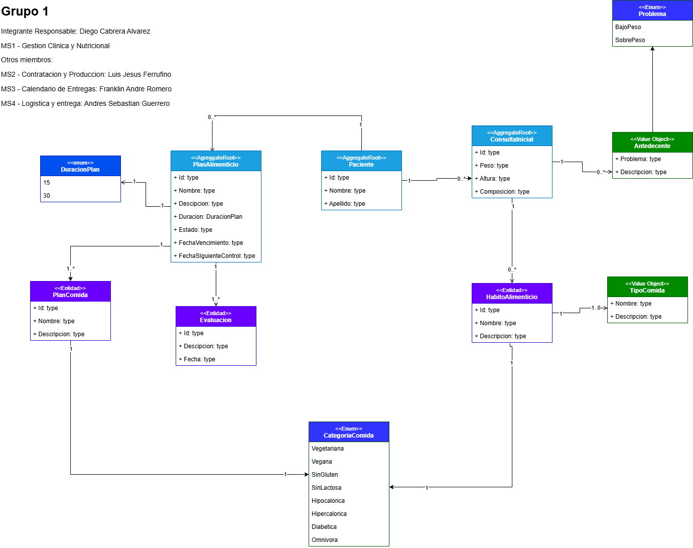
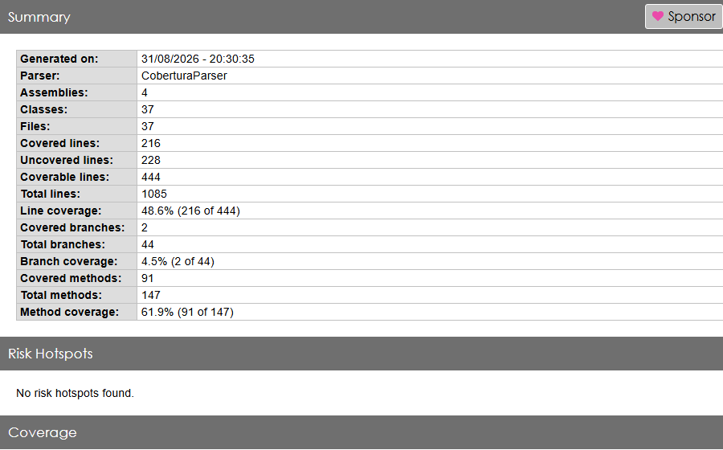

Diagrama actualizado:


## Endpoints de la API

### MS1 - Clínica

| # | Cliente | Método | Endpoint | Descripción |
|:-:|---|:-:|---|---|
| 1 | Paciente | `POST` | `/api/v1/consultation` | Crea una solicitud de atención inicial |
| 2 | Recepcionista | `PATCH` | `/api/v1/consultation/{patientId}/approve` | Aprueba la consulta y cambia su estado |
| 3 | Nutricionista | `POST` | `/api/v1/patient/{patientId}/plan` | Asigna un plan alimenticio al paciente |
| 4 | Nutricionista | `PATCH` | `/api/v1/patient/{planAlimenticioId}/schedulePlan` | Agenda la próxima cita de evaluación |
| 5 | Nutricionista | `POST` | `/api/v1/patient/{planAlimenticioId}/CreateControlEvaluation` | Agrega una evaluación de control al plan |
| 6 | Nutricionista | `GET` | `/api/v1/patient/{planAlimenticioId}/controlEvaluationHistory` | Devuelve el historial de evaluaciones |
| 7 | Nutricionista | `GET` | `/api/v1/consultations/{patientId}/consultations` | Devuelve el historial de consultas del paciente |
| 8 | Paciente | `GET` | `/api/v1/patient/{id}/evolutions` | El paciente visualiza la evolución de sus mediciones |

### MS2 - Catálogo

Consumido internamente por MS1 (no expuesto al front-end):

| # | Método | Endpoint | Descripción |
|:-:|:-:|---|---|
| 3.1 | `GET` | `/api/v1/catalog/plans/{id}` | MS1 valida que el Plan ID exista antes de asignarlo |

## Tests

El proyecto `Tests` contiene tests unitarios (NUnit + FakeItEasy) sobre los handlers de `GestionClinicaNutricional.Application` y sobre los controllers de `GestionClinicaNutricionalService.WebApi`.

### Ejecutar los tests

```bash
dotnet test Tests/Tests.csproj
```

### Ejecutar los tests con cobertura de código

Se usa `coverlet.collector` a través de `dotnet test`. El archivo `coverlet.runsettings` (en la raíz del repo) excluye del cálculo de cobertura la carpeta `GestionClinicaNutricional.Infrastructure/Migrations` (código autogenerado por EF Core, sin valor de testear).

```bash
dotnet test Tests/Tests.csproj --collect:"XPlat Code Coverage" --settings coverlet.runsettings
```

Esto genera `Tests/TestResults/<guid>/coverage.cobertura.xml`.

### Generar el reporte HTML

```bash
# Una sola vez, si no está instalado:
dotnet tool install -g dotnet-reportgenerator-globaltool

reportgenerator -reports:"Tests/TestResults/*/coverage.cobertura.xml" -targetdir:coveragereport -reporttypes:Html
```

Luego abrir `coveragereport/index.html` en el navegador.

### Automatización

- **Claude Code:** este flujo completo (correr tests, generar el reporte de cobertura y resumir el resultado) está empaquetado en el skill [`test-coverage`](.claude/skills/test-coverage), invocable con `/test-coverage` dentro de una sesión de Claude Code.
- **CI (GitHub Actions):** [`.github/workflows/tests.yml`](.github/workflows/tests.yml) corre este mismo flujo en cada push y pull request a `main`:
  - Restaura dependencias y corre los tests en `Release` con `--collect:"XPlat Code Coverage"` y `coverlet.runsettings`.
  - Genera el reporte de cobertura (HTML, Markdown, badges) con ReportGenerator y publica el resumen en `GITHUB_STEP_SUMMARY` (visible directamente en la pestaña *Actions* del run).
  - Sube dos artifacts descargables: `test-results` (.trx) y `coverage-report` (HTML), con 15 días de retención.
  - Los steps de reporte corren con `if: always()`, así que el reporte se genera incluso si algún test falla.

### Estado actual de la cobertura



- **Line coverage:** 48.6% (216/444)
- **Method coverage:** 61.9% (91/147)

#### Clases cubiertas (100%)

**Application — Handlers**
- `Paciente.ApproveConsultaHandler`
- `Paciente.CreateConsultaHandler`
- `Paciente.CreatePacienteHandler`
- `Paciente.GetConsultasHandler`
- `PlanAlimenticio.CreateEvaluacionHandler`
- `PlanAlimenticio.CreatePlanAlimenticioHandler`
- `PlanAlimenticio.GetEvaluacionesHandler`
- `PlanAlimenticio.ProximaEvaluacionHandler`

**WebApi — Controllers**
- `AtencionController`
- `ConsultationController`
- `PacienteController`
- `PatientController`

**Application — Commands** (records, cubiertos vía uso en los tests de arriba)
- `CreateConsultaCommand`, `GetConsultasCommand`, `CreateEvaluacionCommand`, `CreatePlanAlimenticioCommand`, `ProximaEvaluacionCommand`

#### Clases parcialmente cubiertas

- `ApproveConsultaCommand` (50%), `CreatePacienteCommand` (75%), `GetEvaluacionesCommand` (50%) — falta ejercitar algunos miembros generados por el record (`with`, `Equals`, etc.).
- Entidades de dominio (`Antecedente`, `ConsultaInicial`, `Evaluacion`, `HabitoAlimenticio`, `Paciente`, `PlanAlimenticio`) — cubiertas indirectamente por los tests de handlers/controllers, pero no todas sus propiedades/ramas se ejercitan.

#### Clases sin cubrir (pendientes)

- `Application.Consultas.CreateConsultaInicialCommand` — no tiene handler propio todavía.
- `Application.DependencyInjection` / `Infrastructure.DependencyInjection` — registro de servicios, se prueba mejor con un test de integración de arranque.
- `Infrastructure.Repositories.ConsultaInicialRepository`, `PacienteRepository`, `PlanAlimenticioRepository`, `Infrastructure.UnitOfWork` — requieren tests de integración contra una base de datos (in-memory o SQL real), no unitarios.
- `Domain.PlanComida`, `Domain.TipoComida` — records simples, sin lógica propia.
- `GestionClinicaNutricionalService.ExcludeHabitoAlimenticioPropertySchemaProcessor` — procesador de esquema de NSwag, se prueba mejor generando el swagger.json.
- `Program` (WebApi) — bootstrap de la app, requiere un test de integración (`WebApplicationFactory`).
- `Infrastructure.Migrations.*` — excluido intencionalmente del reporte (código autogenerado por EF Core).
- `Infrastructure.DatabaseContext` — excluido intencionalmente con `[ExcludeFromCodeCoverage]` (requiere una base de datos real).